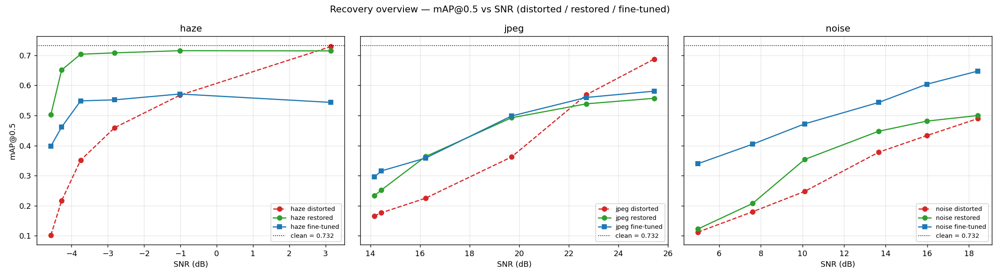
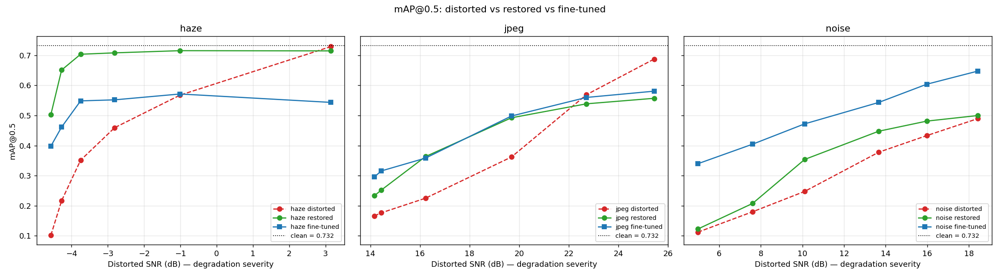

# Image Processing / Vision Course Project

We test how three computer-vision tasks — OBB object detection (YOLOv8s-OBB),
edge detection (HED), and ORB feature matching — degrade under three image
distortions (haze, JPEG compression, additive sensor noise) across a range of
intensities, and which recovery strategy wins: **enhancing the image**
(classical restoration) versus **adapting the model** (fine-tuning on distorted
data). Every stage is measured against ground truth on a frozen subset of the
DOTA-v1.0 aerial dataset, reported **per class** and **per SNR**.

## Team

_To be filled in (names + emails)._

## Executive Summary

**The question.** When a vision model meets a degraded image, do you fix the
image or fix the model?

**The answer — it depends on the distortion** (mean mAP@0.5 over the 6 severity
levels per family; clean baseline = **0.732**):

- **Haze → enhance the image.** Dark-channel-prior dehazing (**0.666**) beats the
  fine-tuned specialist (**0.512**): a physics prior that inverts the haze
  formation model recovers contrast the detector can only partly learn to see
  through.
- **Noise → adapt the model.** The fine-tuned specialist (**0.502**) decisively
  beats denoising (**0.352**), which erased fine detail along with the grain.
- **JPEG → a tie.** Fine-tuning (**0.435**) and restoration (**0.406**) track
  closely across the SNR range; neither dominates.



*Distorted vs. restored vs. fine-tuned mAP@0.5 against SNR, one panel per
distortion. The crossover — restoration (green) wins haze, fine-tuning (blue)
wins noise, the two converge on JPEG — is this project's headline result.*

The study runs in four measurement stages, each evaluated against the same
ground truth: **clean baseline** → **distorted** (3 distortions × 6 levels) →
**restored** (one classical enhancement per distortion) → **fine-tuned** (a
distortion specialist per family). The sections below follow that spine.

## Setup

### Dataset

| Choice | Link | Why |
|--------|------|-----|
| **DOTA v1.0** (Dataset for Object Detection in Aerial Images) | <https://captain-whu.github.io/DOTA/dataset.html> | Aerial imagery with high-quality bounding-box GT for 15 categories. Distortions like haze, compression, and sensor noise tell a strong real-world story (atmospheric scattering, downlink bandwidth, low-light shadows). Manageable size — we use a 200-tile (1024×1024) subset, 160 train / 40 test, frozen with `random.seed(7)`. |

200 tiles (1024×1024) are drawn from DOTA v1.0 train + val splits, frozen with
`random.seed(7)`: **160 train** / **40 test**. The 40-tile test split is the
evaluation set for every stage and is never touched by fine-tuning.

Code: [`scripts/download_dota.py`](scripts/download_dota.py) · [`src/dota_utils.py`](src/dota_utils.py) · [`notebooks/01_eda.ipynb`](notebooks/01_eda.ipynb)

**Sample annotated tiles (4×4 grid)**

<!-- Run notebooks/01_eda.ipynb to generate this image -->


**Class distribution**


**Annotations-per-tile distribution**


### Tasks & metrics

Three tasks spanning a low-level / high-level mix, at least one a DL model:

| # | Task | Type | Model / Algorithm | Metric | Pretrained on |
|---|------|------|-------------------|--------|---------------|
| 1 | Object detection | high-level, DL | [YOLOv8s-OBB](https://docs.ultralytics.com/models/yolov8/) (Ultralytics) | mAP@0.5, per class | DOTA-v1.0 (15 classes) — OBB output is converted to AABB via `r.obb.xyxy` |
| 2 | Edge detection | low-level, DL | [HED](https://arxiv.org/abs/1504.06375) (PyTorch port) | F-score ODS | BSDS500 |
| 3 | Feature matching | low-level, classical | [ORB](https://docs.opencv.org/4.x/d1/d89/tutorial_py_orb.html) + BFMatcher + Lowe ratio | Good-match ratio | — |

### Distortions & enhancements

Three distortions, each paired with one matched classical enhancement:

| # | Distortion | Synthesis | Sweep | Enhancement (classical) | Method |
|---|-----------|-----------|-------|--------------------------|--------|
| 1 | Atmospheric haze | Scattering model `I = J·t + A·(1−t)` | β ∈ {0.5, 1.0, 1.5, 2.0, 2.5, 3.0} | [Dark Channel Prior](https://ieeexplore.ieee.org/document/5567108) dehazing | DCP + guided-filter soft matting |
| 2 | JPEG compression | OpenCV `imencode/imdecode` at low quality | q ∈ {1, 3, 5, 10, 20, 40} | Bilateral on Y (YCrCb) | OpenCV `cv2.bilateralFilter` |
| 3 | Sensor noise | Gaussian read (σ_g) + signal-dependent shot (std √I) | σ_g ∈ {5, 10, 15, 25, 35, 50} | NL-Means + bilateral pass | OpenCV `fastNlMeansDenoisingColored` + bilateral |

Recovery is evaluated two ways — classical **enhancement** (Stage 3) and
**fine-tuning** distortion specialists (Stage 4). The fine-tuning target is one
`yolov8s-obb` checkpoint per distortion family (`yolo-haze.pt`, `yolo-jpeg.pt`,
`yolo-noise.pt`); HED and ORB stay frozen.

### Evaluation protocol

- **Per class:** mAP@0.5 per DOTA class for detection; per-class F-score for
  edges (per polygon-derived class map); per-image good-match ratio for ORB.
- **Per SNR:** every distortion swept across 6 intensities; SNR (dB) computed on
  each (clean, distorted) pair and averaged for the curves. Definition:
  `SNR_dB = 10 · log10( mean(clean²) / mean((clean − distorted)²) )`.
- **Headline figure** per distortion: three lines on `mAP@0.5 vs SNR` —
  pretrained on distorted, pretrained on restored, fine-tuned on distorted.

## Stage 1 — Clean baseline

Zero-shot performance on the 40 clean test tiles, used as the reference all later
stages are measured against.

### Detection (YOLOv8s-OBB, DOTA-v1.0-pretrained)

| Metric | Value |
|--------|-------|
| mAP@0.5 (mean over 14 classes with GT or preds) | **0.732** |
| Tiles with ≥1 detection | 38 / 40 |
| Total detections across the test split | 491 |
| Mean detection confidence | 0.75 |


The DOTA-OBB-pretrained YOLOv8s recognises **12 of 14 visible classes at AP > 0.20**, with strong performance on plane (0.89), ship (0.79), storage-tank (0.92), tennis-court (0.97), basketball-court (1.00), bridge (0.90), and ground-track-field (0.89). The two weak classes — roundabout (0.20) and swimming-pool (0.18) — have few GT instances on this 40-tile test split. The wrapper converts the OBB output (`r.obb.xyxy`) to AABB before evaluation, so the YOLO-format labels and standard IoU mAP pipeline stay consistent.

### Edge detection (HED, BSDS500-pretrained)

| Metric | Value |
|--------|-------|
| Mean per-image ODS F-score | 0.175 |
| Best dataset-wide threshold | 130.8 |


Edge GT is dilated AABB outlines from the YOLO labels — a proxy, not human-annotated edges. The relative drop clean→distorted is the meaningful signal.

### Sample predictions (4 tiles: top-2 and bottom-2 by detection count)


### Feature matching (ORB)

ORB's good-match ratio is **distorted vs clean** by construction; on the clean stage alone it is trivially 1.0. Real numbers land in the distorted stage.

## Stage 2 — Distortion & degradation

### Materializing the sweep

The test-split sweep for the three distortions: **720 PNGs** (40 tiles × 3
distortions × 6 levels), with one shared GT (clean labels). Per-image SNR (dB)
is logged at synthesis time in
[`results/distortion_manifest.csv`](results/distortion_manifest.csv).

**Synthesis notes:**
- **Haze:** literal scattering model `I = J·t + A·(1−t)` with `t = exp(-β)`
  (constant depth `d=1`). Atmospheric light `A` is per-image — mean of the
  brightest 0.1% pixels (Tang/He convention) — so the Stage 3 enhancement (DCP)
  reverses the same `A` it would estimate.
- **JPEG:** OpenCV `imencode/imdecode` round-trip at each quality `q ∈ {1, 3, 5, 10, 20, 40}`.
- **Noise:** Gaussian read noise (std `σ_g`) plus signal-dependent shot noise
  (std `sqrt(intensity)`); seeded per-tile via md5 for cross-run determinism.

Code: [`src/distortions.py`](src/distortions.py) · [`scripts/apply_distortions.py`](scripts/apply_distortions.py) · [`notebooks/02_distortions.ipynb`](notebooks/02_distortions.ipynb)


### Measuring degradation

Ran YOLOv8s + HED + ORB on every (distortion, level) combo —
**18 combos × 40 tiles = 720 evaluations per task**. Per-class mAP@0.5 and
per-image HED ODS F-score are measured against the (unchanged) clean GT;
ORB's "good-match ratio" is **distorted vs clean** matched via BFMatcher
(Hamming) + Lowe ratio (this is the first stage where ORB produces non-trivial
numbers). Per-combo CSVs land under
[`results/distorted/{d}/{l}/`](results/distorted/), with sweep aggregates in
[`results/distortion_sweep/`](results/distortion_sweep/).

Code: [`scripts/eval_distorted.py`](scripts/eval_distorted.py) ·
[`src/orb_match.py`](src/orb_match.py) ·
[`notebooks/03_distorted_stage.ipynb`](notebooks/03_distorted_stage.ipynb)

#### mAP@0.5 vs SNR


Starting from the clean baseline of **0.732**, all three distortions drive mAP
monotonically downward — exactly the robustness signal this project is meant
to study. Headline drops:

| Distortion | Sweep extremes | mAP@0.5 |
|---|---|---:|
| Haze | β = 0.5 → β = 3.0 | **0.729 → 0.102** (7.1× drop) |
| JPEG | q = 40 → q = 1     | **0.687 → 0.166** (4.1× drop) |
| Noise| σ = 5 → σ = 50     | **0.489 → 0.112** (4.4× drop) |

**At equal SNR, noise preserves more mAP than JPEG.** At SNR ≈ 14 dB, noise
(σ=15) holds 0.378 while JPEG (q=3) collapses to 0.176 — a ~2× gap from the
same SNR budget. We didn't isolate the cause but the plausible reading is that
JPEG's blocky low-pass artefacts interact with the OBB regressor in a way that
random additive noise does not. Haze at β=0.5 (SNR ≈ +3 dB) is essentially
indistinguishable from clean — the per-image atmospheric light estimate is
close to the image mean for that level, so the multiplicative attenuation is
barely perceptible. The β=0.5 sweep point is too mild to be a useful
degradation sample; the meaningful haze range is β ∈ {1.0, 1.5, 2.0, 2.5, 3.0}.

**Known weakness: swimming-pool (AP=0.18) is genuinely under-recalled** — 64
GT instances across the 40 tiles but only 14 predictions, and 11 of those 14
came from a single tile. Either the GT counts small pools the model trained
only on large ones, or the centroid-cropped 1024×1024 tiles clip pools at the
edge. Reported as a real model weakness, not a pipeline bug.

#### HED ODS F-score vs SNR


**Haze hurts edges; JPEG and noise barely move them.** Haze drops F-score from
0.176 (β=0.5) to 0.062 (β=3.0). JPEG and noise stay within ±0.02 of the
clean baseline (0.175) across their full sweeps — HED's training on
high-frequency natural images makes it robust to both compression artefacts
and additive noise, while haze's low-frequency attenuation kills the very
gradient structure HED relies on.

#### ORB good-match ratio vs SNR


**ORB is the most discriminating signal.** Three distinct degradation shapes:

| Distortion | Behaviour |
|---|---|
| Haze | Cliff at β ≈ 2.5: ratio drops from 0.94 → 0.67 across β ∈ {0.5, 2.0}, then collapses to ~0 at β ∈ {2.5, 3.0} where `t = exp(-β)` is small enough that the image is dominated by `A`. |
| JPEG | Smooth monotonic decay: 0.81 → 0.18 across q ∈ {40, 1}. JPEG quantisation kills high-frequency descriptor structure, so the Lowe-ratio test rejects most matches at low q. |
| Noise | Smooth monotonic decay, gentler than JPEG: 0.80 → 0.37 across σ ∈ {5, 50}. Shot noise blurs descriptors but doesn't wipe them out; the matcher still finds many true correspondences even at σ=50. |

These three curves are the headline finding of the degradation phase: **at the
same SNR, the same distortion family hurts different algorithms by very
different amounts**, which is exactly the robustness question this project
exists to study.

## Stage 3 — Restoration & recovery

Applied the three classical enhancements — **Dark Channel Prior (DCP)**
for haze, **bilateral-on-Y** for JPEG, **NL-Means + bilateral** for noise — to
all 720 distorted tiles (one matched enhancement per distortion family), then
re-ran YOLOv8s-OBB + HED + ORB on the restored images. SNR is recomputed
**restored-vs-clean** so the headline question is direct: *did enhancement
recover signal?* Restored PNGs mirror the distorted layout under
[`data/restored/`](data/restored/); recovery manifest at
[`results/restoration_manifest.csv`](results/restoration_manifest.csv); sweep
aggregates in [`results/restoration_sweep/`](results/restoration_sweep/).

Code: [`src/enhancement.py`](src/enhancement.py) ·
[`scripts/apply_enhancements.py`](scripts/apply_enhancements.py) ·
[`scripts/eval_sweep.py`](scripts/eval_sweep.py) (generalized `--mode {distorted,restored}`) ·
[`notebooks/04_restored_stage.ipynb`](notebooks/04_restored_stage.ipynb)

### SNR recovery (restored − distorted)

| Distortion | Mean SNR gain | Reading |
|---|---:|---|
| Haze  | **+12.2 dB** (peak +17.8 at β=1.5) | DCP working as textbook — the multiplicative haze model is exactly what DCP inverts. |
| Noise | **+4.4 dB** (peak +7.9 at σ=15) | NL-Means recovers real signal across the sweep. |
| JPEG  | **−1.4 dB** | Bilateral-on-Y *reduces* SNR at high quality (it smooths detail JPEG kept); only helps at q=1. |

### Metric recovery (restored − distorted, mean over each sweep)

| Distortion | mAP@0.5 | ODS F | ORB ratio |
|---|---:|---:|---:|
| Haze  | **+0.262** | **+0.045** | **+0.187** |
| JPEG  | +0.042 | +0.001 | **−0.082** |
| Noise | +0.045 | −0.006 | **−0.037** |

In the figures below both curves share the **distorted (input) SNR** as a
common degradation-severity axis, so the vertical gap between the red
(distorted) and green (restored) line at each point reads directly as the
recovery. The restored-vs-clean SNR numbers in the table above come from the
recovery manifest (`snr_gain_db`).


**DCP is the clear win.** Haze is the one distortion where a classical
physics-based prior matches the degradation model exactly, so enhancement
recovers signal on *every* metric — mAP climbs by 0.26 toward the clean 0.732
baseline, ORB matching by 0.19. The honest counterpoint: at β ≥ 2.5 DCP's
transmission estimate collapses to ~`t0` everywhere and the restored tile is
just a tinted copy of the input, so the heavy-haze end recovers little — a
structural limit of the prior, not a code bug.

**Denoising helps detection but hurts matching.** For JPEG and noise the
matched filter buys a modest detection gain (+0.04 mAP) but the smoothing
**costs ORB good-matches** (−0.08 JPEG, −0.04 noise): the bilateral/NL-Means
pass that pleases the OBB regressor also erases the high-frequency descriptor
structure ORB depends on. Edge F-score barely moves either way — HED was
already robust to both distortions at Stage 2, so there is little to recover.
The takeaway mirrors the degradation stage: *one enhancement does not lift every
algorithm equally*, which is exactly the robustness trade-off this project
studies.

## Stage 4 — Fine-tuned specialists

The second recovery strategy: instead of enhancing the image, adapt the model.
Fine-tuned **three `yolov8s-obb` specialists** — one per distortion family —
starting from the DOTA-pretrained baseline. A model that has *seen* the
degradation during training should detect through it better than the pretrained
baseline.

**Data** ([`scripts/build_finetune_data.py`](scripts/build_finetune_data.py)):
the 160-tile train subset is re-split 128/32 train/val (the 40-tile **test split
is never touched**), and each tile is distorted at **all 6 severity levels** of
its family — 768 train + 192 val tiles per specialist. Oriented labels are
regenerated from the raw DOTA annotations via
[`write_yolo_obb_label`](src/dota_utils.py) (the AABB labels used for evaluation
can't train an OBB head). Layout mirrors the distorted stage:
`data/finetune/{family}/{train,val}/{images,labels}/` + a `task: obb` data yaml.

**Training** ([`scripts/finetune.py`](scripts/finetune.py)): `yolov8s-obb.pt`
fine-tuned per family at 640 px, 10 epochs, batch 4 (MPS). Checkpoints land in
`weights/finetuned_{family}.pt` (local — `*.pt` is gitignored like all model
files); training curves + `results.csv` are tracked under
[`results/finetune/`](results/finetune/).

### Training-set adaptation (Ultralytics val mAP, per family's distorted val split)

| Specialist | val mAP@0.5 | val mAP@0.5:0.95 |
|---|---:|---:|
| haze  | 0.809 | 0.613 |
| jpeg  | 0.704 | 0.529 |
| noise | 0.833 | 0.653 |


The ranking makes sense: **noise** is easiest to learn robustness to (the model
learns to ignore high-frequency grain), **jpeg** is hardest because its val
split includes q=1 where real structure is destroyed, and **haze** sits between
(light/medium haze is recoverable, β=3.0 loses contrast). Each number averages
across all six severity levels — including the worst — so 0.70–0.83 is strong
evidence the specialists genuinely adapted to their distortion.

> **These training numbers are not the comparison.** The table above is
> Ultralytics' *internal validation* metric (oriented-IoU OBB mAP on the
> held-out distorted val tiles), computed during training. It is **not**
> directly comparable to the clean baseline `mAP 0.732`, which uses a different
> metric (AABB + VOC all-points AP) on a different image set (the 40 clean test
> tiles). The apples-to-apples comparison follows.

### Metric-comparable evaluation

The three specialists were re-evaluated through the **same** AABB + VOC
all-points-AP pipeline as the distorted and restored sweeps —
`scripts/eval_finetuned.py` runs each specialist on its matched distortion's 6
test combos over the held-out distorted **test** tiles (detections only;
fine-tuning never touched HED/ORB). These numbers are directly comparable to the
clean baseline (mAP 0.732) and to the earlier sweeps. Mean mAP@0.5 over the 6
severity levels per family:

| Family | Distorted | Restored | Fine-tuned | FT − distorted | FT − restored |
|--------|----------:|---------:|-----------:|---------------:|--------------:|
| haze   | 0.404     | **0.666** | 0.512      | +0.108         | −0.154        |
| jpeg   | 0.364     | 0.406     | **0.435**  | +0.071         | +0.029        |
| noise  | 0.307     | 0.352     | **0.502**  | +0.195         | +0.150        |



**The winning recovery strategy is distortion-dependent.** Fine-tuning beats the
distorted baseline on every family (+0.07 to +0.20 mAP), confirming the
specialists genuinely adapted — but it does **not** uniformly beat classical
enhancement. The full discussion of which strategy to use when is below.

Each specialist is family-specific and was evaluated only on its matched
distortion. Results CSV: `results/finetuned_sweep/perclass_detections.csv`;
comparison built in `notebooks/05_finetuned_stage.ipynb`.

## Discussion

### Recovery decision matrix

The central finding is that **no single recovery strategy wins across
distortions** — the right move tracks the physics of the corruption.

| Distortion | Best recovery | mAP@0.5 (best vs. alternative) | Why |
|------------|---------------|--------------------------------|-----|
| Haze  | Enhance (DCP dehazing)   | **0.666** vs. 0.512 (FT)    | A physics prior inverts the haze formation model and restores global contrast directly. |
| Noise | Adapt (fine-tuning)      | **0.502** vs. 0.352 (denoise) | Denoising removes signal with the grain; the detector instead learns noise-robust features. |
| JPEG  | Tie                      | 0.435 (FT) vs. 0.406 (enh.) | Block artefacts are partly invertible and partly learnable; neither dominates. |

Fine-tuning beats the *distorted* baseline on every family (+0.07 to +0.20 mAP),
confirming the specialists genuinely adapted — but "always fine-tune" would be
the wrong lesson: on haze it loses to a classical algorithm with no training at
all. The practical guidance is to match the recovery to the corruption: a
physics-invertible distortion (haze) favours enhancement; a high-frequency,
hard-to-invert distortion (noise) favours adaptation.

### Task sensitivity

The three tasks degraded at different rates, and **ORB feature matching was the
most discriminating signal** across the SNR sweep — its good-match ratio fell
steeply where detection mAP was comparatively robust. This matches the physics:
ORB keypoints depend on fine local gradients that additive noise and JPEG
blocking destroy first, while OBB detection leans on coarser object-scale
structure that survives moderate degradation. HED edge F-score (ODS) sat between
the two, and was itself dominated by haze (low-frequency contrast loss) while
shrugging off noise and JPEG. The practical implication: low-level descriptors
are the early-warning canary for image quality, degrading well before high-level
detection visibly suffers.

### SNR as a predictor

SNR is a useful but imperfect degradation axis. For **additive noise and haze**
the metric-vs-SNR curves are smooth and monotone, so SNR predicts performance
well. For **JPEG** the relationship is weaker: blockiness is structured, not
additive, so equal SNR values do not imply equal task damage — at SNR ≈ 14 dB,
noise (σ=15) holds mAP 0.378 while JPEG (q=3) sits at 0.176, a ~2× gap from the
same SNR budget. SNR is therefore a fair common x-axis for cross-distortion
plots but should not be read as a distortion-agnostic predictor of accuracy.

### Limitations & future work

1. **Synthetic-haze circularity.** Dark Channel Prior partially reverses the
   same scattering model used to synthesize haze, which flatters the haze
   restoration result. Sanity-checked on a real hazy DOTA image where available.
2. **HED GT is a proxy.** Edge GT is dilated DOTA polygon outlines + Canny on
   clean — not true human-annotated edges. Mitigated by reporting the *relative*
   clean→distorted drop, which is robust to a fixed bias.
3. **AABB-from-OBB evaluation.** Oriented boxes are reduced to axis-aligned boxes
   for VOC-style AP; this slightly understates localization quality on rotated
   objects.
4. **Small test split.** Metrics are on 40 held-out tiles per combo, so per-class
   statistics for rare classes (helicopter, ground-track-field) are noisy and
   absolute mAP carries sampling noise — though the cross-strategy *ordering* is
   stable. One tile per source image also ignores most of each scene (chosen to
   keep compute/storage modest).
5. **Single backbone, family-specific specialists.** Only YOLOv8s-OBB was
   studied, and each fine-tuned model saw only its own distortion; a larger
   detector or a single all-distortion specialist was not tested.
6. **Future work.** Combined/compound distortions, a joint enhance-then-fine-tune
   pipeline, and larger evaluation splits.

## Repository layout

```
.
├── README.md      # this file = the project report
├── notebooks/     # 01_eda … 05_finetuned_stage
├── src/           # reusable code (distortions, enhancement, eval, figures)
├── scripts/       # CLIs: download, apply distortions/enhancements, eval, finetune
├── results/       # tracked metric CSVs + manifests + training curves
├── outputs/       # tracked figures (outputs/figures/) + EDA grids
├── tests/         # pytest suite
├── weights/       # OBB weights (fine-tuned *.pt gitignored)
└── data/          # (gitignored) clean / distorted / restored / finetune tiles
```

## Appendix — Weekly progress

Course deliverables by week; the commit history carries the incremental
artifacts (`git log --grep "Week N"`).

| Wk | Deliverable | Where in this report | Representative commit |
|----|-------------|----------------------|-----------------------|
| 1   | Repo + registration | — | `ec7f2b3` |
| 2–3 | Dataset / tasks / distortions / enhancement decisions | §Setup | `34a5e2a` |
| 4   | Download + EDA | §Setup › Dataset | `b88be2c` |
| 5   | Clean runs (model wrappers + orchestrator) | §Stage 1 | `135107a` |
| 6   | Clean metrics vs GT | §Stage 1 | `e4c96c3` |
| 7   | Distortions applied + saved | §Stage 2 | `13d1984` |
| 8   | Degradation measured | §Stage 2 | `f24f028` |
| 9   | Enhancements applied + measured | §Stage 3 | `f4c8691` |
| 10  | Fine-tune specialists | §Stage 4 | `9e4d0fa` |
| 11  | Fine-tuned metric-comparable eval | §Stage 4 | `d0c00b8` |
| 12  | Report restructure + hero figure | this README | (this branch) |
| 13  | PPT + repo review | — | (pending) |
