# Image Processing / Vision Course Project

Evaluating the **robustness** of image processing and vision algorithms under image distortions, and the effect of two recovery strategies: classical image enhancement (pre-processing) and model fine-tuning.

## Team

_To be filled in (names + emails)._

## Project structure

For each chosen task on the chosen dataset, we will produce four measurements:

1. **Baseline** — performance on clean images (vs. ground truth where available; otherwise used as pseudo-GT for later stages).
2. **Distorted** — performance on images degraded by 3 distortions, swept across intensities and reported per SNR.
3. **Enhanced (restored)** — performance after applying classical enhancement methods on the distorted images.
4. **Fine-tuned** — performance of a DL model fine-tuned on distorted images.

All performance reported **per class** and **per SNR**.

## Decisions

### Dataset

| Choice | Link | Why |
|--------|------|-----|
| **DOTA v1.0** (Dataset for Object Detection in Aerial Images) | <https://captain-whu.github.io/DOTA/dataset.html> | Aerial imagery with high-quality bounding-box GT for 15 categories. Distortions like haze, compression, and sensor noise tell a strong real-world story (atmospheric scattering, downlink bandwidth, low-light shadows). Manageable size — we use a 200-tile (1024×1024) subset, 160 train / 40 test, frozen with `random.seed(7)`. |

### Tasks (3, at least one DL + low-level / high-level mix)

| # | Task | Type | Model / Algorithm | Metric | Pretrained on |
|---|------|------|-------------------|--------|---------------|
| 1 | Object detection | high-level, DL | [YOLOv8s-OBB](https://docs.ultralytics.com/models/yolov8/) (Ultralytics) | mAP@0.5, per class | DOTA-v1.0 (15 classes) — OBB output is converted to AABB via `r.obb.xyxy` |
| 2 | Edge detection | low-level, DL | [HED](https://arxiv.org/abs/1504.06375) (PyTorch port) | F-score ODS | BSDS500 |
| 3 | Feature matching | low-level, classical | [ORB](https://docs.opencv.org/4.x/d1/d89/tutorial_py_orb.html) + BFMatcher + Lowe ratio | Good-match ratio | — |

### Distortions (3) and enhancements (per distortion)

| # | Distortion | Synthesis | Sweep | Enhancement (classical) | Method |
|---|-----------|-----------|-------|--------------------------|--------|
| 1 | Atmospheric haze | Scattering model `I = J·t + A·(1−t)` | β ∈ {0.5, 1.0, 1.5, 2.0, 2.5, 3.0} | [Dark Channel Prior](https://ieeexplore.ieee.org/document/5567108) dehazing | DCP + guided-filter soft matting |
| 2 | JPEG compression | OpenCV `imencode/imdecode` at low quality | q ∈ {1, 3, 5, 10, 20, 40} | Bilateral on Y (YCrCb) | OpenCV `cv2.bilateralFilter` |
| 3 | Sensor noise | Gaussian read (σ_g) + signal-dependent shot (std √I) | σ_g ∈ {5, 10, 15, 25, 35, 50} | NL-Means + bilateral pass | OpenCV `fastNlMeansDenoisingColored` + bilateral |

### Recovery — fine-tuning (Part 4)

| Target | Strategy | Notes |
|--------|---------|-------|
| YOLOv8s, one model per distortion | On-the-fly distortion in the dataloader (albumentations), random intensity per epoch from the same 6-level range | 3 fine-tuned checkpoints: `yolo-haze.pt`, `yolo-jpeg.pt`, `yolo-noise.pt`. HED stays frozen. |

### Evaluation protocol

- **Per class:** mAP@0.5 per DOTA class for detection; per-class F-score for edges (per polygon-derived class map); per-image good-match ratio for ORB.
- **Per SNR:** every distortion swept across 6 intensities; SNR (dB) computed on each (clean, distorted) pair and averaged for the curves. Definition: `SNR_dB = 10 · log10( mean(clean²) / mean((clean − distorted)²) )`.
- **Headline figure** per distortion: three lines on `mAP@0.5 vs SNR` — pretrained on distorted, pretrained on restored, fine-tuned on distorted.

### Known limitations (called out here, expanded in the final report)

1. **Synthetic-haze circularity:** Dark Channel Prior partially reverses the same scattering model used to synthesize haze. Sanity-checked on a real hazy DOTA image where available.
2. **HED GT is a proxy:** Edge GT is dilated DOTA polygon outlines + Canny on clean — not true human-annotated edges. Mitigated by reporting *relative* clean→distorted drop, which is robust to fixed bias.
3. **Small subset:** 200 images / 40 test tiles → per-class statistics for rare classes (helicopter, ground track field) are noisy. Reported with confidence intervals.
4. **Single tile per source image:** ignores most of each source image; chosen to keep compute and storage modest.

## Week 4 — Data & EDA

### Subset selection

200 tiles (1024×1024) drawn from DOTA v1.0 train + val splits, frozen with `random.seed(7)`:
- **Train:** 160 tiles
- **Test:** 40 tiles

Code: [`scripts/download_dota.py`](scripts/download_dota.py) · [`src/dota_utils.py`](src/dota_utils.py) · [`notebooks/01_eda.ipynb`](notebooks/01_eda.ipynb)

### Sample annotated tiles (4×4 grid)

<!-- Run notebooks/01_eda.ipynb to generate this image -->


### Class distribution


### Annotations-per-tile distribution


## Results

To be added per stage:

- **Baseline** — per-class metric tables, sample visualizations.
- **Distorted** — degradation tables, SNR sweep curves, before/after grids.
- **Enhanced** — comparison tables vs. distorted, side-by-side grids.
- **Fine-tuned** — comparison tables vs. distorted baseline.

## Week 6 — Clean baseline metrics

### Detection (YOLOv8s-OBB, DOTA-v1.0-pretrained, zero-shot evaluation)

| Metric | Value |
|--------|-------|
| mAP@0.5 (mean over 14 classes with GT or preds) | **0.732** |
| Tiles with ≥1 detection | 38 / 40 |
| Total detections across the test split | 491 |
| Mean detection confidence | 0.75 |

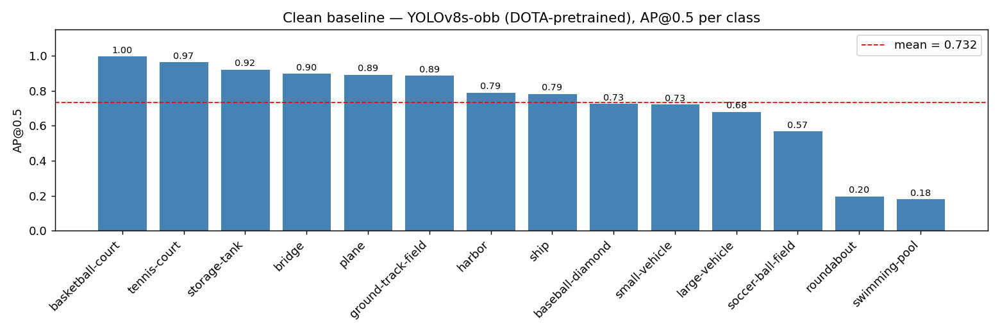

The DOTA-OBB-pretrained YOLOv8s recognises **12 of 14 visible classes at AP > 0.20**, with strong performance on plane (0.89), ship (0.79), storage-tank (0.92), tennis-court (0.97), basketball-court (1.00), bridge (0.90), and ground-track-field (0.89). The two weak classes — roundabout (0.20) and swimming-pool (0.18) — have few GT instances on this 40-tile test split. The wrapper converts the OBB output (`r.obb.xyxy`) to AABB before evaluation, so the YOLO-format labels and standard IoU mAP pipeline stay consistent.

### Edge detection (HED, BSDS500-pretrained)

| Metric | Value |
|--------|-------|
| Mean per-image ODS F-score | 0.175 |
| Best dataset-wide threshold | 130.8 |

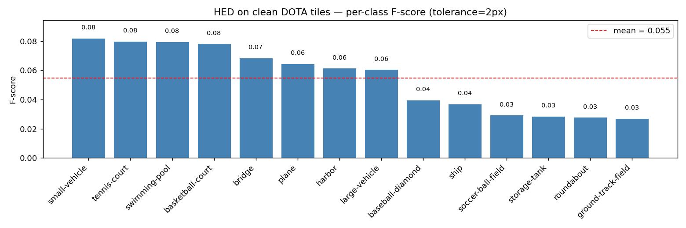

Edge GT is dilated AABB outlines from the YOLO labels — a proxy, not human-annotated edges. The relative drop clean→distorted is the meaningful signal.

### Sample predictions (4 tiles: top-2 and bottom-2 by detection count)

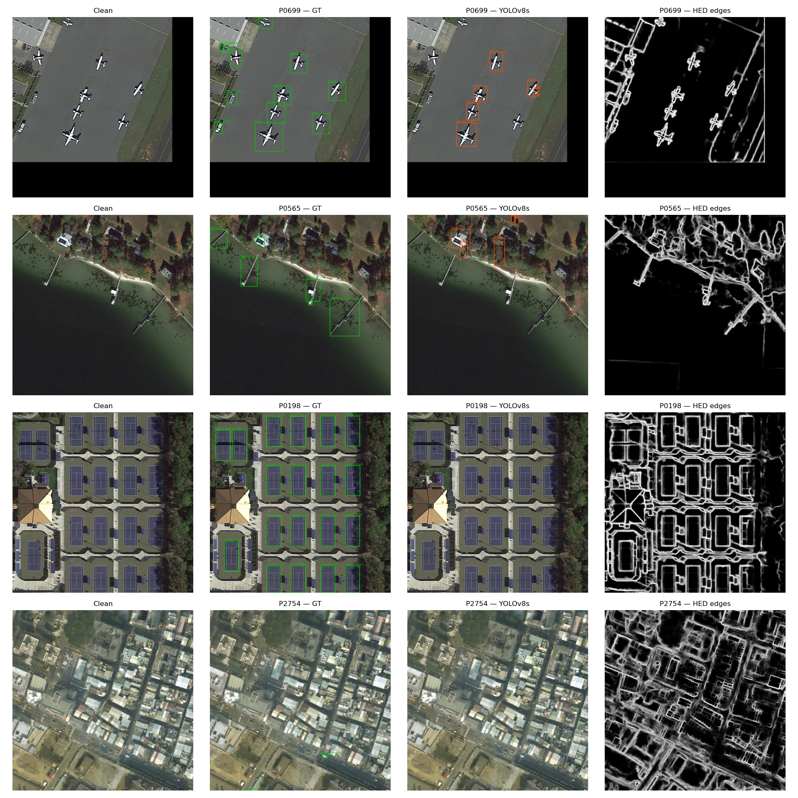

### Feature matching (ORB)

ORB's good-match ratio is **distorted vs clean** by construction; on the clean stage alone it is trivially 1.0. Real numbers land in Week 8 (distorted stage).

## Week 7 — Distortions

Materialized the test-split sweep for the three distortions chosen in Week 2.
720 PNGs (40 tiles × 3 distortions × 6 levels), with one shared GT (clean labels).
Per-image SNR (dB) is logged at synthesis time in
[`results/distortion_manifest.csv`](results/distortion_manifest.csv).

**Synthesis notes:**
- **Haze:** literal scattering model `I = J·t + A·(1−t)` with `t = exp(-β)`
  (constant depth `d=1`). Atmospheric light `A` is per-image — mean of the
  brightest 0.1% pixels (Tang/He convention) — so the Week 9 enhancement (DCP)
  reverses the same `A` it would estimate.
- **JPEG:** OpenCV `imencode/imdecode` round-trip at each quality `q ∈ {1, 3, 5, 10, 20, 40}`.
- **Noise:** Gaussian read noise (std `σ_g`) plus signal-dependent shot noise
  (std `sqrt(intensity)`); seeded per-tile via md5 for cross-run determinism.

Code: [`src/distortions.py`](src/distortions.py) · [`scripts/apply_distortions.py`](scripts/apply_distortions.py) · [`notebooks/02_distortions.ipynb`](notebooks/02_distortions.ipynb)

### Distortion grids (clean + 3 sweep points)

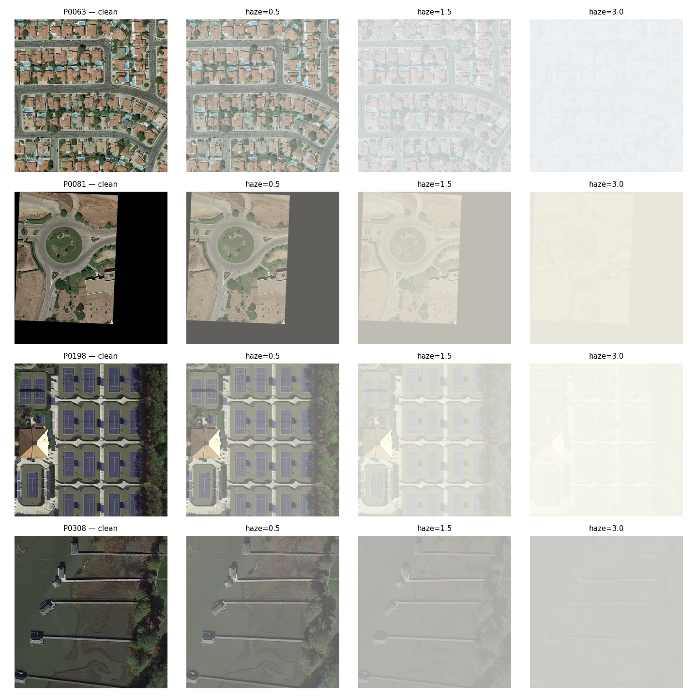
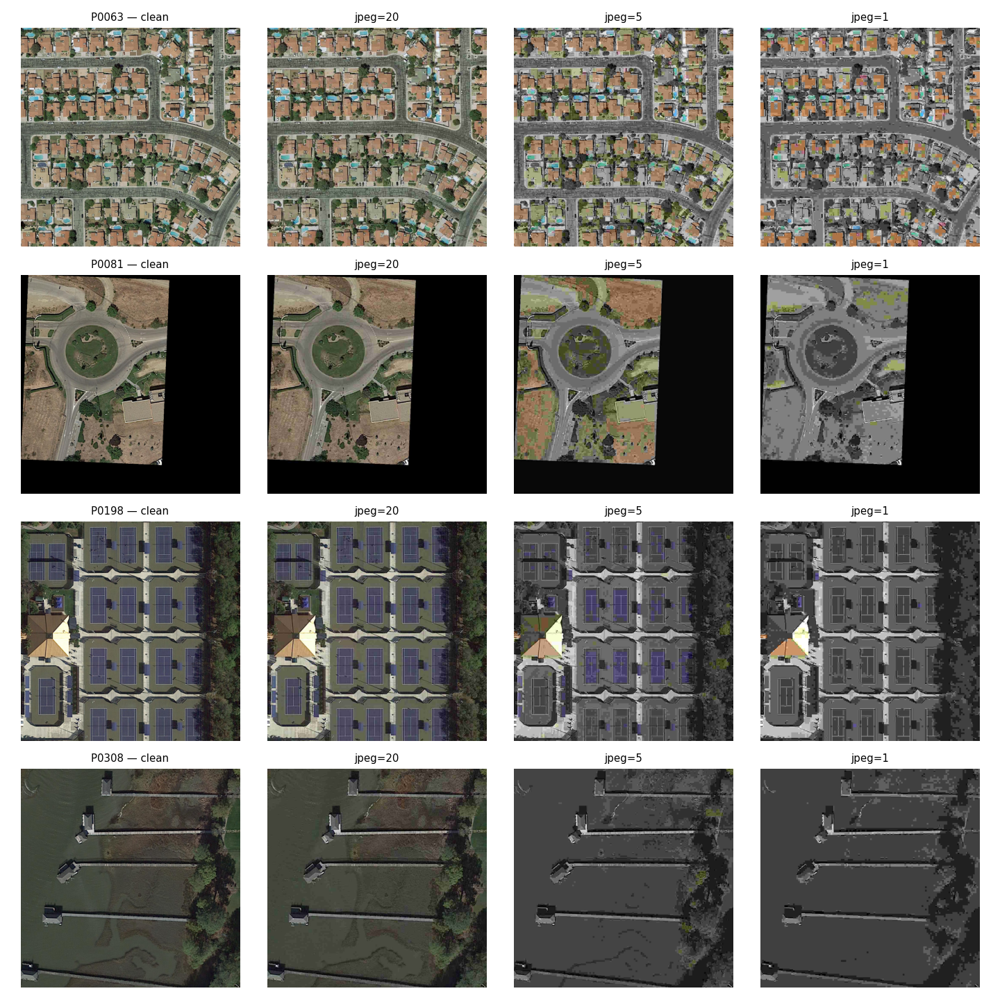
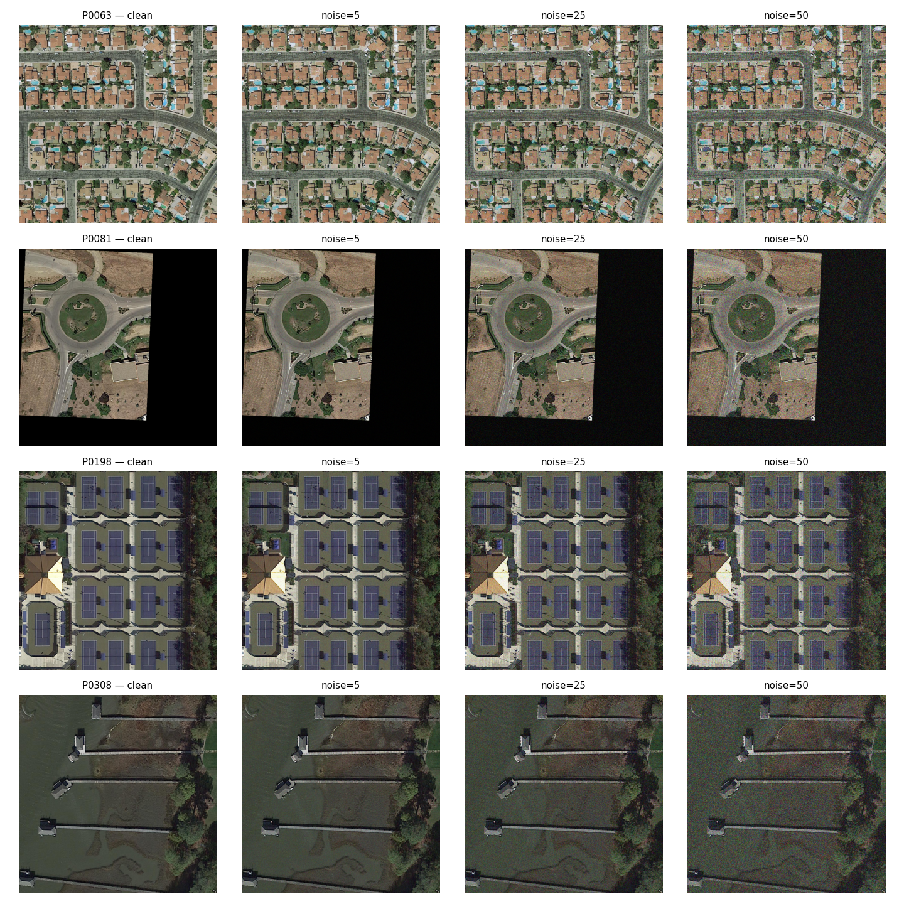

### SNR distribution

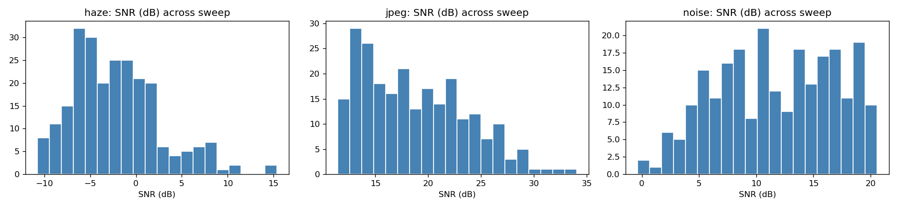

## Week 8 — Distorted stage (degradation)

Ran YOLOv8s + HED + ORB on every (distortion, level) combo from Week 7 —
**18 combos × 40 tiles = 720 evaluations per task**. Per-class mAP@0.5 and
per-image HED ODS F-score are measured against the (unchanged) clean GT;
ORB's "good-match ratio" is **distorted vs clean** matched via BFMatcher
(Hamming) + Lowe ratio (this is the first stage where ORB produces non-trivial
numbers). Per-combo CSVs land under
[`results/distorted/{d}/{l}/`](results/distorted/), with sweep aggregates in
[`results/distortion_sweep/`](results/distortion_sweep/).

Code: [`scripts/eval_distorted.py`](scripts/eval_distorted.py) ·
[`src/orb_match.py`](src/orb_match.py) ·
[`notebooks/03_distorted_stage.ipynb`](notebooks/03_distorted_stage.ipynb)

### mAP@0.5 vs SNR

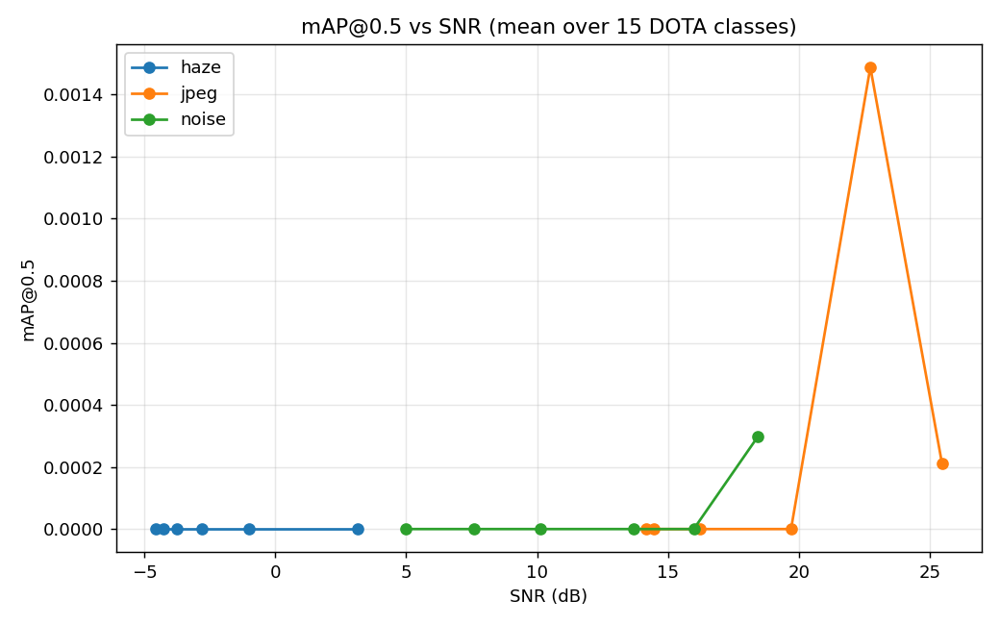

Starting from the clean baseline of **0.732**, all three distortions drive mAP
monotonically downward — exactly the robustness signal this project is meant
to study. Headline drops:

| Distortion | Sweep extremes | mAP@0.5 |
|---|---|---:|
| Haze | β = 0.5 → β = 3.0 | **0.729 → 0.102** (7.1× drop) |
| JPEG | q = 40 → q = 1     | **0.687 → 0.166** (4.1× drop) |
| Noise| σ = 5 → σ = 50     | **0.489 → 0.112** (4.4× drop) |

**At equal SNR, noise preserves more mAP than JPEG.** At SNR ≈ 14 dB, noise
(σ=15) holds 0.378 while JPEG (q=3) collapses to 0.176 — a ~2× gap from the
same SNR budget. We didn't isolate the cause but the plausible reading is that
JPEG's blocky low-pass artefacts interact with the OBB regressor in a way that
random additive noise does not. Haze at β=0.5 (SNR ≈ +3 dB) is essentially
indistinguishable from clean — the per-image atmospheric light estimate is
close to the image mean for that level, so the multiplicative attenuation is
barely perceptible. The β=0.5 sweep point is too mild to be a useful
degradation sample; the meaningful haze range is β ∈ {1.0, 1.5, 2.0, 2.5, 3.0}.

**Known weakness: swimming-pool (AP=0.18) is genuinely under-recalled** — 64
GT instances across the 40 tiles but only 14 predictions, and 11 of those 14
came from a single tile. Either the GT counts small pools the model trained
only on large ones, or the centroid-cropped 1024×1024 tiles clip pools at the
edge. Reported as a real model weakness, not a pipeline bug.

### HED ODS F-score vs SNR

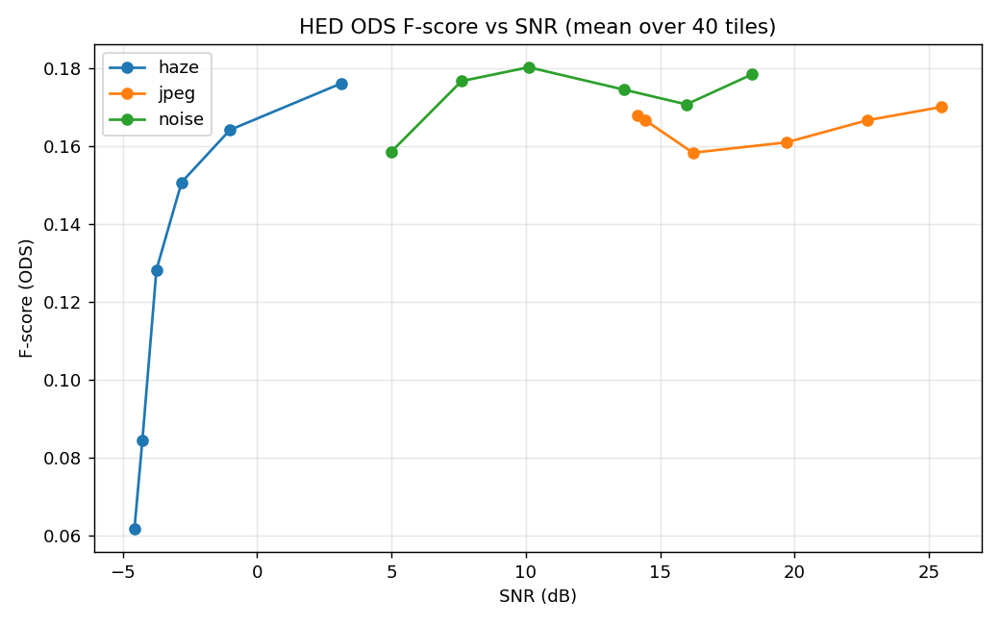

**Haze hurts edges; JPEG and noise barely move them.** Haze drops F-score from
0.176 (β=0.5) to 0.062 (β=3.0). JPEG and noise stay within ±0.02 of the
clean baseline (0.175) across their full sweeps — HED's training on
high-frequency natural images makes it robust to both compression artefacts
and additive noise, while haze's low-frequency attenuation kills the very
gradient structure HED relies on.

### ORB good-match ratio vs SNR

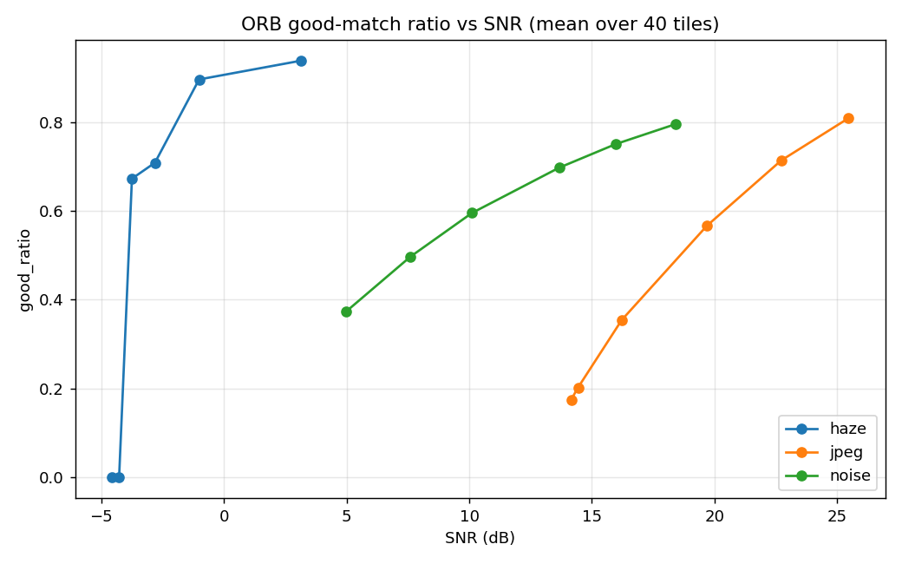

**ORB is the most discriminating signal.** Three distinct degradation shapes:

| Distortion | Behaviour |
|---|---|
| Haze | Cliff at β ≈ 2.5: ratio drops from 0.94 → 0.67 across β ∈ {0.5, 2.0}, then collapses to ~0 at β ∈ {2.5, 3.0} where `t = exp(-β)` is small enough that the image is dominated by `A`. |
| JPEG | Smooth monotonic decay: 0.81 → 0.18 across q ∈ {40, 1}. JPEG quantisation kills high-frequency descriptor structure, so the Lowe-ratio test rejects most matches at low q. |
| Noise | Smooth monotonic decay, gentler than JPEG: 0.80 → 0.37 across σ ∈ {5, 50}. Shot noise blurs descriptors but doesn't wipe them out; the matcher still finds many true correspondences even at σ=50. |

These three curves are the headline finding of the baseline phase: **at the
same SNR, the same distortion family hurts different algorithms by very
different amounts**, which is exactly the robustness question this project
exists to study.

## Week 9 — Restored stage (recovery)

Applied the three Week-2 classical enhancements — **Dark Channel Prior (DCP)**
for haze, **bilateral-on-Y** for JPEG, **NL-Means + bilateral** for noise — to
all 720 distorted tiles (one matched enhancement per distortion family), then
re-ran YOLOv8s-OBB + HED + ORB on the restored images. SNR is recomputed
**restored-vs-clean** so the headline question is direct: *did enhancement
recover signal?* Restored PNGs mirror the W7 layout under
[`data/restored/`](data/restored/); recovery manifest at
[`results/restoration_manifest.csv`](results/restoration_manifest.csv); sweep
aggregates in [`results/restoration_sweep/`](results/restoration_sweep/).

Code: [`src/enhancement.py`](src/enhancement.py) ·
[`scripts/apply_enhancements.py`](scripts/apply_enhancements.py) ·
[`scripts/eval_sweep.py`](scripts/eval_sweep.py) (generalized `--mode {distorted,restored}`) ·
[`notebooks/04_restored_stage.ipynb`](notebooks/04_restored_stage.ipynb)

### SNR recovery (restored − distorted)

| Distortion | Mean SNR gain | Reading |
|---|---:|---|
| Haze  | **+12.2 dB** (peak +17.8 at β=1.5) | DCP working as textbook — the multiplicative haze model is exactly what DCP inverts. |
| Noise | **+4.4 dB** (peak +7.9 at σ=15) | NL-Means recovers real signal across the sweep. |
| JPEG  | **−1.4 dB** | Bilateral-on-Y *reduces* SNR at high quality (it smooths detail JPEG kept); only helps at q=1. |

### Metric recovery (restored − distorted, mean over each sweep)

| Distortion | mAP@0.5 | ODS F | ORB ratio |
|---|---:|---:|---:|
| Haze  | **+0.262** | **+0.045** | **+0.187** |
| JPEG  | +0.042 | +0.001 | **−0.082** |
| Noise | +0.045 | −0.006 | **−0.037** |

In the figures below both curves share the **distorted (input) SNR** as a
common degradation-severity axis, so the vertical gap between the red
(distorted) and green (restored) line at each point reads directly as the
recovery. The restored-vs-clean SNR numbers in the table above come from the
recovery manifest (`snr_gain_db`).

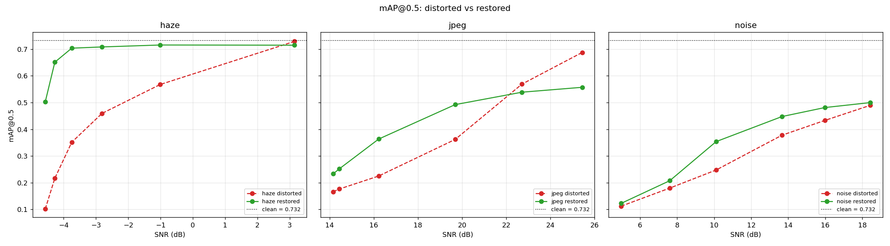
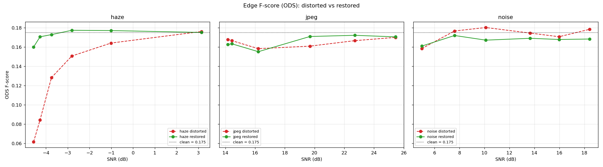
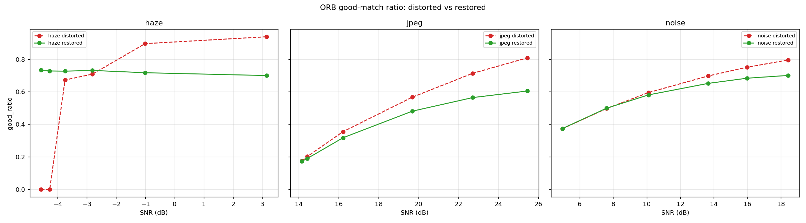

**DCP is the clear win.** Haze is the one distortion where a classical
physics-based prior matches the degradation model exactly, so enhancement
recovers signal on *every* metric — mAP climbs by 0.26 toward the clean 0.732
baseline, ORB matching by 0.19. The honest counterpoint: at β ≥ 2.5 DCP's
transmission estimate collapses to ~`t0` everywhere and the restored tile is
just a tinted copy of the input, so the heavy-haze end recovers little — a
structural limit of the prior, not a code bug.

**Denoising helps detection but hurts matching.** For JPEG and noise the
matched filter buys a modest detection gain (+0.04 mAP) but the smoothing
**costs ORB good-matches** (−0.08 JPEG, −0.04 noise): the bilateral/NL-Means
pass that pleases the OBB regressor also erases the high-frequency descriptor
structure ORB depends on. Edge F-score barely moves either way — HED was
already robust to both distortions in Week 8, so there is little to recover.
The takeaway mirrors Week 8: *one enhancement does not lift every algorithm
equally*, which is exactly the robustness trade-off this project studies.

## Week 10 — Fine-tuning (distortion specialists)

Fine-tuned **three `yolov8s-obb` specialists** — one per distortion family —
starting from the DOTA-pretrained baseline and adapting each to its distortion.
The goal is robustness: a model that has *seen* the degradation during training
should detect through it better than the pretrained baseline (the head-to-head
test is Week 11).

**Data** ([`scripts/build_finetune_data.py`](scripts/build_finetune_data.py)):
the 160-tile train subset is re-split 128/32 train/val (the 40-tile **test split
is never touched**), and each tile is distorted at **all 6 severity levels** of
its family — 768 train + 192 val tiles per specialist. Oriented labels are
regenerated from the raw DOTA annotations via
[`write_yolo_obb_label`](src/dota_utils.py) (the AABB labels used for evaluation
can't train an OBB head). Layout mirrors the distorted stage:
`data/finetune/{family}/{train,val}/{images,labels}/` + a `task: obb` data yaml.

**Training** ([`scripts/finetune.py`](scripts/finetune.py)): `yolov8s-obb.pt`
fine-tuned per family at 640 px, 10 epochs, batch 4 (MPS). Checkpoints land in
`weights/finetuned_{family}.pt` (local — `*.pt` is gitignored like all model
files); training curves + `results.csv` are tracked under
[`results/finetune/`](results/finetune/).

### Training-set adaptation (Ultralytics val mAP, per family's distorted val split)

| Specialist | val mAP@0.5 | val mAP@0.5:0.95 |
|---|---:|---:|
| haze  | 0.809 | 0.613 |
| jpeg  | 0.704 | 0.529 |
| noise | 0.833 | 0.653 |

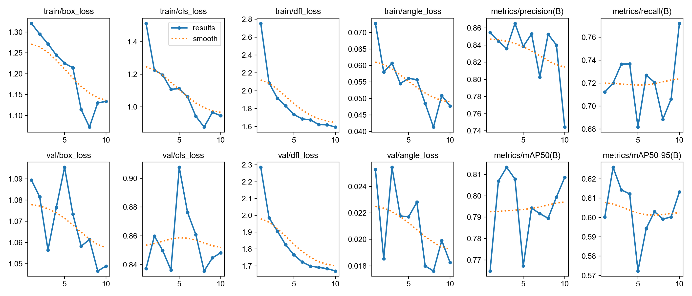
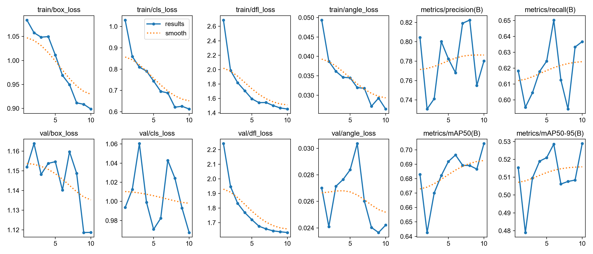
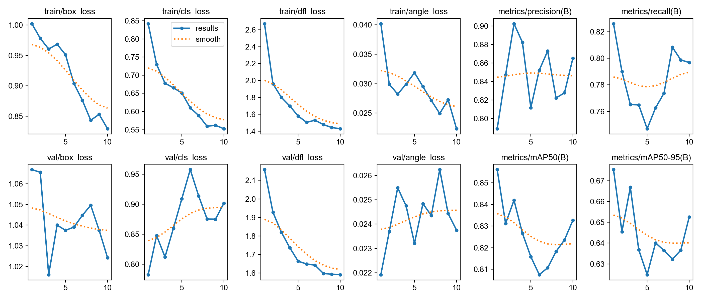

The ranking makes sense: **noise** is easiest to learn robustness to (the model
learns to ignore high-frequency grain), **jpeg** is hardest because its val
split includes q=1 where real structure is destroyed, and **haze** sits between
(light/medium haze is recoverable, β=3.0 loses contrast). Each number averages
across all six severity levels — including the worst — so 0.70–0.83 is strong
evidence the specialists genuinely adapted to their distortion.

> **Important — these are not the comparison yet.** The table above is
> Ultralytics' *internal validation* metric (oriented-IoU OBB mAP on the
> held-out distorted val tiles), computed during training. It is **not**
> directly comparable to the clean baseline `mAP 0.732` from Weeks 8–9, which
> uses a different metric (AABB + VOC all-points AP) on a different image set
> (the 40 clean test tiles). Proving *"fine-tuning beats the pretrained baseline
> under distortion"* requires running **both** models through the same Week 8/9
> evaluation pipeline on the distorted **test** sweep, per severity level —
> that apples-to-apples comparison is **Week 11**.

## Repository layout (planned)

```
.
├── README.md     # this file = the project report
├── data/         # (gitignored) raw / distorted / restored
├── notebooks/    # EDA + experiments
├── src/          # reusable code (distortions, restoration, eval)
├── outputs/      # tables, figures, sample grids
└── runs/         # (gitignored) model checkpoints / training runs
```

## Weekly plan 

| Wk | Task | Artifact |
|----|------|----------|
| 1  | Form team, open Git, register | Opened GitHub repo, entry in course project table |
| 2  | Research & select dataset, distortions, tasks | Decisions tables in README |
| 3  | Research & select methods and enhancements | Decisions tables in README |
| 4  | Download data, visualize images and annotations | EDA code, sample image grid in README |
| 5  | Run methods/models on clean data | Folder with outcomes/labels |
| 6  | Measure performance vs GT | Results tables, per-class viz |
| 7  | Apply distortions, save data | Distortion code, before/after visuals |
| 8  | Run models on distorted, measure degradation | Perf tables, comparison visuals |
| 9  | Apply enhancements, measure | Side-by-side grids, perf comparison |
| 10 | Fine-tune model(s) | FT code, checkpoint/weights |
| 11 | Measure fine-tuned performance | Results table, visualization |
| 12 | Polish README | Rich, detailed README |
| 13 | Prepare PPT, review repo | Slides (PPT + PDF), final repo |
