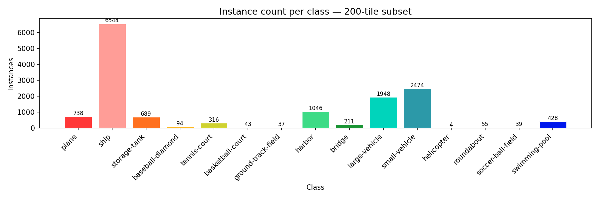
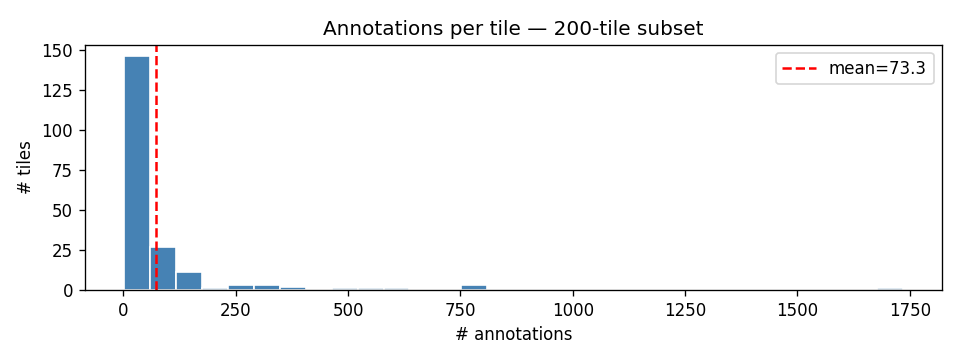

# Image Processing / Vision Course Project

Evaluating the **robustness** of image processing and vision algorithms under image distortions, and the effect of two recovery strategies: classical image enhancement (pre-processing) and model fine-tuning.

## Team

_To be filled in (names + emails)._

## Project structure

For each chosen task on the chosen dataset, we will produce four measurements:

1. **Baseline** — performance on clean images (vs. ground truth where available; otherwise used as pseudo-GT for later stages).
2. **Distorted** — performance on images degraded by 3 distortions, swept across intensities and reported per SNR.
3. **Enhanced (restored)** — performance after applying classical enhancement methods on the distorted images.
4. **Fine-tuned** — performance of a DL model fine-tuned on distorted images.

All performance reported **per class** and **per SNR**.

## Decisions

### Dataset

| Choice | Link | Why |
|--------|------|-----|
| **DOTA v1.0** (Dataset for Object Detection in Aerial Images) | <https://captain-whu.github.io/DOTA/dataset.html> | Aerial imagery with high-quality bounding-box GT for 15 categories. Distortions like haze, compression, and sensor noise tell a strong real-world story (atmospheric scattering, downlink bandwidth, low-light shadows). Manageable size — we use a 200-tile (1024×1024) subset, 160 train / 40 test, frozen with `random.seed(7)`. |

### Tasks (3, at least one DL + low-level / high-level mix)

| # | Task | Type | Model / Algorithm | Metric | Pretrained on |
|---|------|------|-------------------|--------|---------------|
| 1 | Object detection | high-level, DL | [YOLOv8s](https://docs.ultralytics.com/models/yolov8/) (Ultralytics) | mAP@0.5, per class | COCO |
| 2 | Edge detection | low-level, DL | [HED](https://arxiv.org/abs/1504.06375) (PyTorch port) | F-score ODS | BSDS500 |
| 3 | Feature matching | low-level, classical | [ORB](https://docs.opencv.org/4.x/d1/d89/tutorial_py_orb.html) + BFMatcher + Lowe ratio | Good-match ratio | — |

### Distortions (3) and enhancements (per distortion)

| # | Distortion | Synthesis | Sweep | Enhancement (classical) | Method |
|---|-----------|-----------|-------|--------------------------|--------|
| 1 | Atmospheric haze | Scattering model `I = J·t + A·(1−t)` | β ∈ {0.5, 1.0, 1.5, 2.0, 2.5, 3.0} | [Dark Channel Prior](https://ieeexplore.ieee.org/document/5567108) dehazing | DCP + guided-filter soft matting |
| 2 | JPEG compression | OpenCV `imencode/imdecode` at low quality | q ∈ {1, 3, 5, 10, 20, 40} | Bilateral on Y (YCrCb) | OpenCV `cv2.bilateralFilter` |
| 3 | Sensor noise | Gaussian (σ_g) + Poisson shot | σ_g ∈ {5, 10, 15, 25, 35, 50} | NL-Means + bilateral pass | OpenCV `fastNlMeansDenoisingColored` + bilateral |

### Recovery — fine-tuning (Part 4)

| Target | Strategy | Notes |
|--------|---------|-------|
| YOLOv8s, one model per distortion | On-the-fly distortion in the dataloader (albumentations), random intensity per epoch from the same 6-level range | 3 fine-tuned checkpoints: `yolo-haze.pt`, `yolo-jpeg.pt`, `yolo-noise.pt`. HED stays frozen. |

### Evaluation protocol

- **Per class:** mAP@0.5 per DOTA class for detection; per-class F-score for edges (per polygon-derived class map); per-image good-match ratio for ORB.
- **Per SNR:** every distortion swept across 6 intensities; SNR (dB) computed on each (clean, distorted) pair and averaged for the curves. Definition: `SNR_dB = 10 · log10( mean(clean²) / mean((clean − distorted)²) )`.
- **Headline figure** per distortion: three lines on `mAP@0.5 vs SNR` — pretrained on distorted, pretrained on restored, fine-tuned on distorted.

### Known limitations (called out here, expanded in the final report)

1. **Synthetic-haze circularity:** Dark Channel Prior partially reverses the same scattering model used to synthesize haze. Sanity-checked on a real hazy DOTA image where available.
2. **HED GT is a proxy:** Edge GT is dilated DOTA polygon outlines + Canny on clean — not true human-annotated edges. Mitigated by reporting *relative* clean→distorted drop, which is robust to fixed bias.
3. **Small subset:** 200 images / 40 test tiles → per-class statistics for rare classes (helicopter, ground track field) are noisy. Reported with confidence intervals.
4. **Single tile per source image:** ignores most of each source image; chosen to keep compute and storage modest.

## Week 4 — Data & EDA

### Subset selection

200 tiles (1024×1024) drawn from DOTA v1.0 train + val splits, frozen with `random.seed(7)`:
- **Train:** 160 tiles
- **Test:** 40 tiles

Code: [`scripts/download_dota.py`](scripts/download_dota.py) · [`src/dota_utils.py`](src/dota_utils.py) · [`notebooks/01_eda.ipynb`](notebooks/01_eda.ipynb)

### Sample annotated tiles (4×4 grid)

<!-- Run notebooks/01_eda.ipynb to generate this image -->


### Class distribution



### Annotations-per-tile distribution



## Results

To be added per stage:

- **Baseline** — per-class metric tables, sample visualizations.
- **Distorted** — degradation tables, SNR sweep curves, before/after grids.
- **Enhanced** — comparison tables vs. distorted, side-by-side grids.
- **Fine-tuned** — comparison tables vs. distorted baseline.

## Repository layout (planned)

```
.
├── README.md     # this file = the project report
├── data/         # (gitignored) raw / distorted / restored
├── notebooks/    # EDA + experiments
├── src/          # reusable code (distortions, restoration, eval)
├── outputs/      # tables, figures, sample grids
└── runs/         # (gitignored) model checkpoints / training runs
```

## Weekly plan 

| Wk | Task | Artifact |
|----|------|----------|
| 1  | Form team, open Git, register | Opened GitHub repo, entry in course project table |
| 2  | Research & select dataset, distortions, tasks | Decisions tables in README |
| 3  | Research & select methods and enhancements | Decisions tables in README |
| 4  | Download data, visualize images and annotations | EDA code, sample image grid in README |
| 5  | Run methods/models on clean data | Folder with outcomes/labels |
| 6  | Measure performance vs GT | Results tables, per-class viz |
| 7  | Apply distortions, save data | Distortion code, before/after visuals |
| 8  | Run models on distorted, measure degradation | Perf tables, comparison visuals |
| 9  | Apply enhancements, measure | Side-by-side grids, perf comparison |
| 10 | Fine-tune model(s) | FT code, checkpoint/weights |
| 11 | Measure fine-tuned performance | Results table, visualization |
| 12 | Polish README | Rich, detailed README |
| 13 | Prepare PPT, review repo | Slides (PPT + PDF), final repo |
